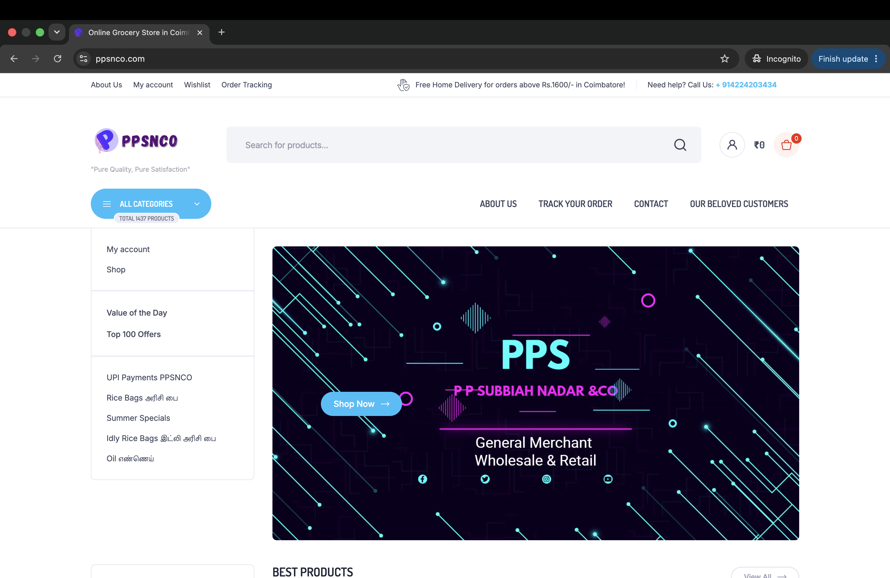
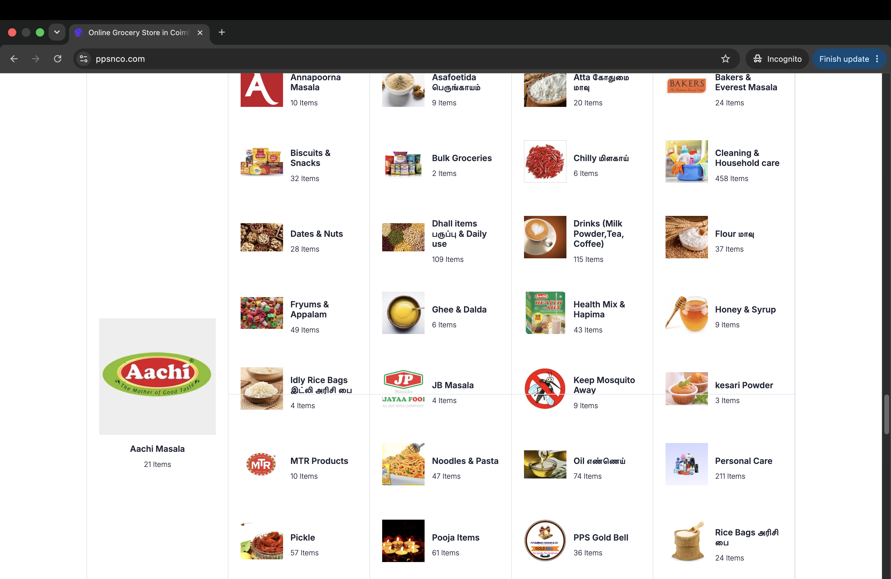

# PPSNCO Groceries & Savings

## Live Website
https://ppsnco.com

## Project Overview

PPSNCO is a grocery e-commerce platform built using WordPress and WooCommerce. It offers online grocery shopping, home delivery in Coimbatore, and shipping across India.

## My Role

- Website Management
- WooCommerce Store Setup
- Product Catalog Management (2200+ Products)
- Mobile App Management
- Performance Optimization
- Payment Gateway Configuration
- SEO Improvements

## Technologies Used

- WordPress
- WooCommerce
- Elementor
- PHP
- MySQL
- Cloudflare
- Hostinger Cloud Hosting
- Flutter (FluxBuilder App)

## Key Features

- Grocery Ordering
- Secure Online Payments
- Product Search
- Mobile App Support
- Home Delivery
- Shipping Across India

## Screenshots

### Homepage

### Categories

### Cart Page

### Checkout Page

### Order Tracking

## Live Demo

https://ppsnco.com
